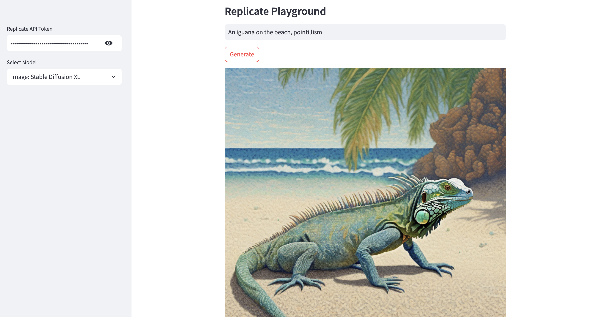

# replicate
[Replicate](https://replicate.com) is a platform for hosting and running machine learning (ML) models with a cloud API, without having to manage your own infrastructure. Sign up for an account at Replicate and get an API token, which you'll need for this project.

This repository showcases a simple Streamlit app for running the following open-source text, code, image, audio, and music generation models on Replicate:
* Text: Meta Llama 3 70B Instruct
* Text: Meta Llama 3.1 405B Instruct
* Text: Google Gemma 7B Instruct
* Text: Mixtral 8x7B Instruct
* Image: Stable Diffusion 3
* Image: Black Forest Labs Flux Schnell
* Code: Meta Code Llama 70B Instruct
* Audio: Suno AI Bark
* Music: Meta MusicGen

For a detailed guide, see [this](https://alphasec.io/running-open-source-generative-ai-models-on-replicate/) post. To deploy on [Railway](https://railway.app/?referralCode=alphasec) using a one-click template, click the button below.

